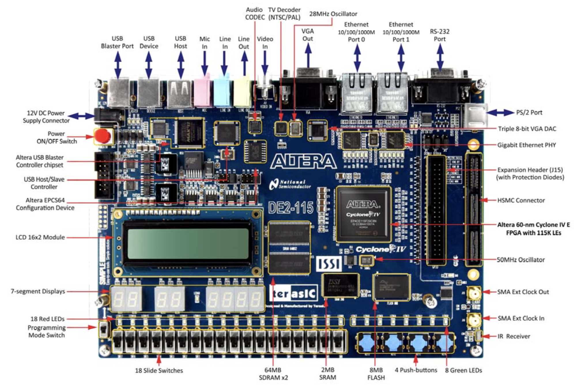
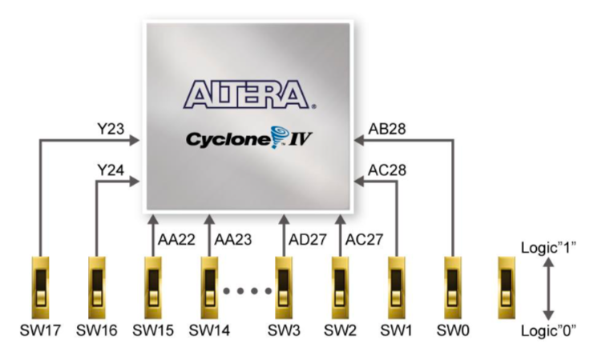
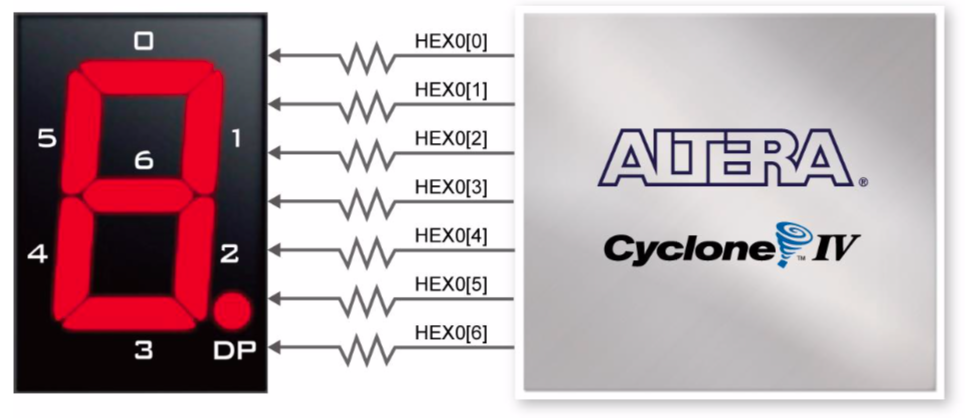
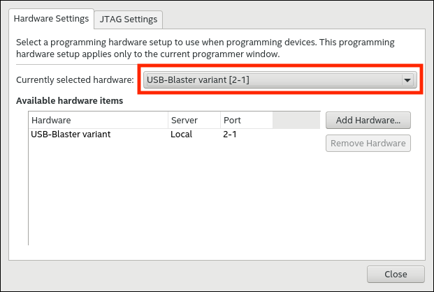
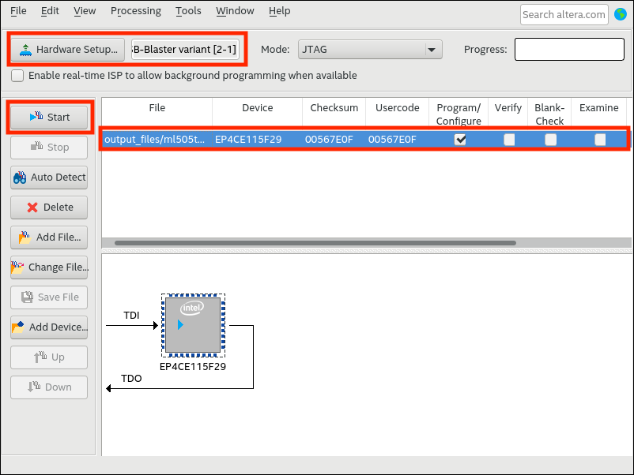
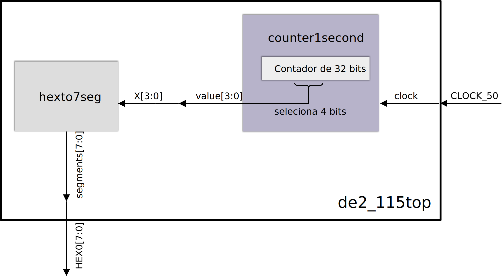

# Lab 4b: Trabalhando com a Placa de Desenvolvimento

Prof. João Carlos Bittencourt

Centro de Ciências Exatas e Tecnológicas

Universidade Federal do Recôncavo da Bahia, Cruz das Almas

## Introdução

Essa segunda parte do roteiro, consiste de três etapas, cada qual construída com base na anterior. Ele ainda apresenta a plataforma de desenvolvimento de hardware que será usada até o final do semestre. Ao longo desta prática você irá:

- Manusear a placa de forma segura, ligando e conectando ela ao computador;
- Projetar codificadores/decodificadores (para alimentar um _display_ de 7-segmentos);
- Projetar uma referência de tempo usando contadores;
- Trabalhar com mapas de pinos do dispositivo FPGA;
- Programar um circuito sequencial na placa DE2-115;

## Leia o Manual

GCET231 utiliza a plataforma de desenvolvimento FPGA ALTERA DE2-115. As informações sobre o kit podem ser obtidas no [site da Terasic](https://www.terasic.com.tw/cgi-bin/page/archive.pl?Language=English&CategoryNo=139&No=502&PartNo=4). Faça o download do manual e leia atentamente às seguintes seções:

- 2.1 Layout and Components
- 2.2 Block Diagram of the DE2-115 Board
- 2.3 Power-up the DE2-115 Board

Ao longo dos próximos roteiros, é importante que você continue a leitura do manual, especialmente o **Capítulo 4**.

## A Placa DE2-115

A figura abaixo apresenta um perfil da placa, indicando os componentes presentes no kit.

A seguir apresentamos uma lista elencando os seus componentes principais sob o ponto de vista de GCET231.

- FPGA Cyclone IV 4CE115
- Visor LCD 16x2
- Programador USB Blaster
- 18 Chaves
- 4 Push-buttons
- GPIO
- Interface VGA
- Interface Serial (USART)
- 18 LEDs Vermelhos
- 9 LEDs Verdes
- Displays de 7 segmentos
- Memórias Flash e RAM

## Um Codificador para Display de 7-segmentos

Vamos começar projetando um codificador capaz de converter um único dígito decimal (valor de 4-bits) em um padrão binário capaz de exibir sua representação em um _display_ de 7-segmentos. Siga os passos dos roteiros anteriores para criar um novo projeto.

> Certifique-se de selecionar corretamente o dispositivo FPGA utilizado na plataforma de desenvolvimento (`EP4CE115F29C7`).

Adicione o arquivo `dec7seg.sv`, fornecido dentro da pasta `src`, ao seu novo projeto. A plataforma DE2-115 possui um conjunto de _displays_ de 7-segmentos de 8 dígitos. Neste laboratório, nós usaremos apenas um dígito (o mais à direita); os outros sete permanecerão inativos.

Localize as Seções 4.2 e 4.4 do User Manual da placa DE2-115 e leia cuidadosamente de modo a entender o funcionamento das chaves e do _display_ de 7-segmentos. Os esquemáticos referentes ao _display_ de 7-segmentos e as chaves foram repetidos nas Figuras abaixo, apenas por conveniência.

> Esquemático das chaves (_switches_) da DE2-115.

> Esquemático do display de 7 segmentos da DE2-115.

O módulo especificado no arquivo `de2_115top.sv` já está configurado de modo a mapear as portas de entrada/saída para pinos da placa.

- Nós usaremos as quatro chaves mais à direita para a entrada de 4-bits, `SW[3:0]`. Na DE2-115, esses pinos são nomeados como `AD27, AC27, AC28, AB28` (confira na figura acima, localizando também os rótulos próximos às chaves, na placa). Nesta configuração `AD27` é o MSB e `AB28` é o LSB.
- Nós usaremos também uma saída de 7-bits no nosso módulo SystemVerilog (`HEX0[6:0]`) para conectar a saída referente ao _display_ de 7-segmentos. Na DE2-115, esses pinos são nomeados como `H22, J22, L25, L26, E17, F22, G18`.

Essas conexões são definidas em um ou mais "**Quartus Settings File**" (arquivos QSF). As configurações padrão para projetos da DE2-115 são apresentadas no arquivo `de2_115_default.qsf` presente no diretório `fpga`. Para importar as configurações, clique em **Assignments** `>` **Import Assignments...** Localize o arquivo `de2_115_default.qsf`, dentro do diretório `fpga`, e clique em **OK**.

Certifique-se de ler o arquivo fornecido (`dec7seg.sv`) e o manual de referência da placa, e garanta que você também entendeu por que existe uma negação na frente da atribuição do padrão em `segments[6:0]`.

Agora modifique a implementação do arquivo `de2_115top.sv` de modo que ele apresente uma instância de `dec7seg` devidamente ligada aos pinos de entrada e saída da placa.

Quando estiver pronto para testar a sua implementação, compile seu projeto e programe-o na placa. Para isso, clique em **Processing** `>` **Start Compilation**. Uma vez que o processamento seja finalizado, conecte o cabo USB do kit na entrada indicada como **USB Blaster** e em uma das portas USB do computador. Abra a ferramenta de programação acessando **Tools** `>` **Programmer**. Clique em **Hardware Setup** para escolher o dispositivo de programação **USB Blaster**.

Certifique-se de que a ferramenta selecionou o arquivo `de2_115top.sof` e então clique em no botão **Start**.

Se tudo ocorrer como esperado, seu circuito está agora programado e em execução.

> ✅ Agora é sua vez de brincar com as chaves para verificar se as saídas correspondem ao esperado.

## Um Codificador Hexadecimal para Display de 7 Segmentos

Copie o conteúdo do arquivo `dec7seg.sv` e cole em um novo arquivo chamado `hexto7seg.sv`. Modifique o nome do módulo para `hexto7seg`. Altere o arquivo `de2_115top.sv` de modo a instanciar o módulo `hexto7seg`.

> 💁 Comente a instância de `dec7seg` e inclua a nova instancia para `hexto7seg`).

Modifique o codificador para lidar com um dígito hexadecimal (ou seja, de "0" até "F"). Basicamente, você precisa acrescentar seis linhas adicionais ao módulo, para lidar com os casos "A" até "F". Não importa se você escolher exibir as letras maiúsculas ou minúsculas (ex., "a" _vs._ "A").

Recompile seu projeto, programe-o na placa e confirme se o circuito é capaz de exibir de "0" até "F".

## Exibindo um contador de único dígito Hexadecimal

Modifique o projeto de modo que o valor a ser exibido não parta das chaves de entrada. Em vez disso, crie um contador que percorra os valores "0" -- "F" repetidas vezes, e transmita esse valor dentro do seu codificador hexadecimal. Para observar se o seu projeto está funcionando corretamente, o contador deve operar a uma velocidade razoável. Faça-o contar a uma taxa de aproximadamente uma transição por segundo (~1 Hz).

Seu contador precisará de um sinal de _clock_. Para isso, a placa DE2-115 fornece um sinal de 50 MHz no pino `Y2` (veja a Seção 4.5 do manual da DE2-115). Certifique-se ainda de que você recebeu um arquivo chamado `de2_115_default.sdc`, junto com os arquivos de laboratório, dentro do diretório `fpga`. Adicione esse arquivo ao seu projeto no Quartus Prime.

> 💁 Dentre outras coisas, esse arquivo cria uma referência de clock para o seu circuito, de modo que a ferramenta de síntese possa sintetizar seu circuito levando em consideração as restrições de tempo do circuito.

Uma vez que a placa fornece um clock de 50 MHz, no arquivo `de2_115_default.sdc` criamos um sinal `sys_clk_pin` com período igual a 20 ns (equivalente a 50 MHz) e associamos ele à porta `CLOCK_50`, declarada no arquivo `de2_115top.sv`, a qual, por sua vez está associada ao pino `Y2` do dispositivo FPGA.

Elabore um contador de 32-bits, mesmo que ele use somente quatro bits. Os bits menos significativos, obviamente, transitarão com uma frequência maior (o LSB muda 50 milhões de vezes em 1 segundo!). Por outro lado, os bits mais significativo alternam com uma velocidade menor. Você deve encontrar 4 bits consecutivos em algum lugar dentro do vetor de modo que o bit menos significativo alterne, aproximadamente, uma vez por segundo (1~Hz). Esses 4 bits formarão um número hexadecimal (`0x0` até `0xF`), que deve ser exibido no _display_ de 7-segmentos.

> 💁 Você não chegará a obter exatamente o equivalente a uma transição por segundo, mas qualquer taxa entre meio segundo e dois segundos poderá ser considerada para avaliação.

Certifique-se de produzir um circuito modularizado, ou seja, o módulo `de2_115top` deve possuir dois módulos (um contador e um codificador hexadecimal para 7-segmentos). Dessa forma, devem haver três arquivos distintos:

- `hexto7seg.sv` já desenvolvido.
- `counter1second.sv` usado para contar um valor de 4 bits que muda a uma taxa aproximada de 1 valor por segundo.
- `de2_115top.sv` contém uma instância do módulo `hexto7seg`, e uma instância do módulo `counter1second`. Esse módulo deve produzir a saída `HEX0` de 7 bits.

Lembre-se de usar os nomes de arquivo solicitados acima e seguir um modelo de hierarquia indicado. O diagrama a seguir apresenta a hierarquia que o seu projeto deve seguir. **Você será penalizado se o projeto não seguir a construção modular especificada nessa figura.**

> 💁 Na figura acima, o módulo `hexto7seg` é chamada de `X[3:0]`, enquanto a saída de 4 bits do `counter1second` é chamada de `value[3:0]`. Esses são nomes internos à definição dos módulos. No módulo _top level_ `de2_115top`, que engloba os outros dois módulos, você deve declarar um `wire` de 4 bits com nome da sua escolha, o qual deve conectar os dois módulos. Esse procedimento é semelhante a uma declaração de função em linguagens de software, como C: os nomes das variáveis dentro de uma função não precisam ter o mesmo nome quando chamamos essa função.

## Acompanhamento (próximo laboratório)

Durante a aula esteja pronto para apresentar para o professor ou monitor:

- O código dos arquivos `hexto7seg.sv`, `counter1second.sv` e `de2_115top.sv`
- Apresente uma demonstração do contador hexadecimal produzido no laboratório.

## Agradecimentos

Este laboratório é o resultado do trabalho de docentes e monitores de GCET231 ao longo dos anos, incluindo:

- **18.1:** Caio França dos Santos
- **18.2:** Matheus Rosa Pithon
- **20.2:** Matheus Rosa Pithon
- **21.1:** Matheus Rosa Pithon, Éverton Gomes dos Santos
- **21.2:** Éverton Gomes dos Santos
