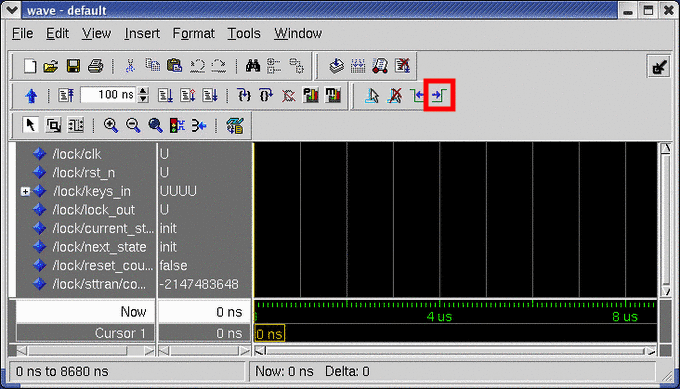
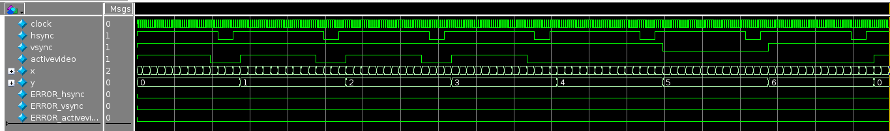
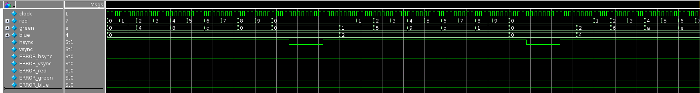
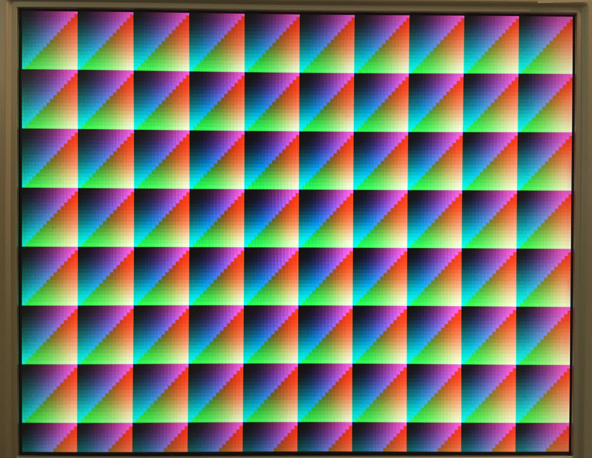
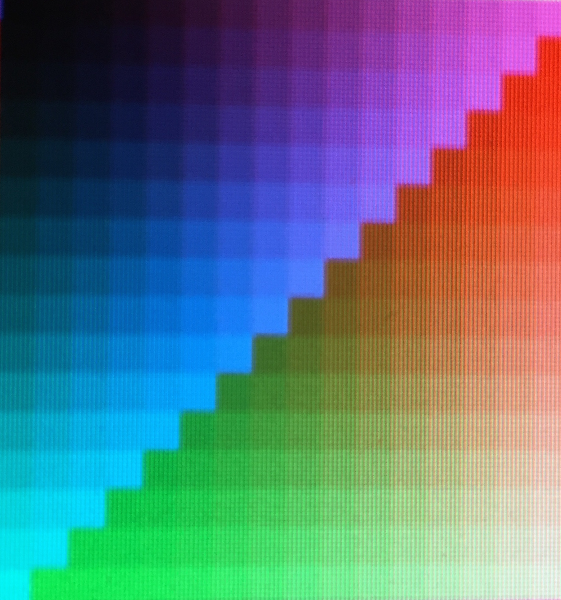
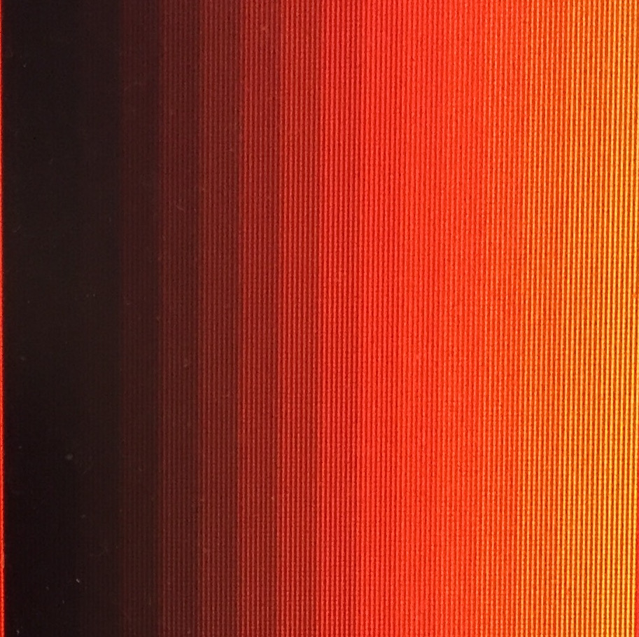
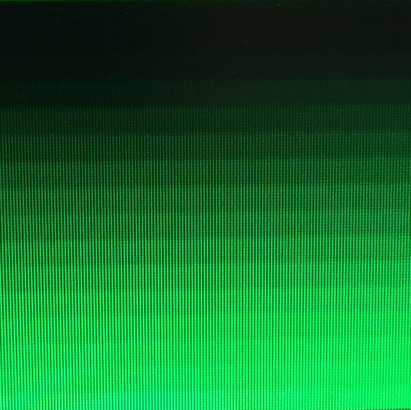
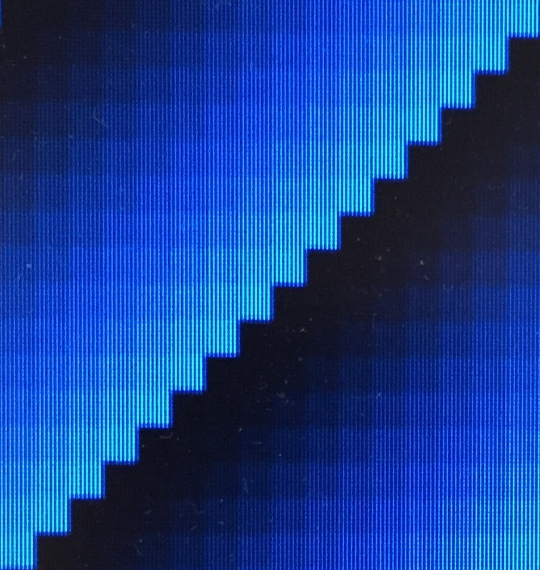

# Laboratório 5: Gerador de Sincronismo VGA

<p align="center">Prof. João Carlos Bittencourt</p>
<p align="center">Centro de Ciências Exatas e Tecnológicas</p>
<p align="center">Universidade Federal do Recôncavo da Bahia, Cruz das Almas</p>

## Introdução

Este laboratório é mais uma das atividades de instrumentação na plataforma de desenvolvimento DE2-115. O roteiro consiste de três etapas, cada qual construída com base na anterior.

Ao longo deste laboratório você irá aprender a:

- Projetar contadores: contando a uma fração (em potência de 2) da frequência do clock e contando em 2D.
- Entender com monitores VGA funcionam.
- Produzir sinais de temporização para alimentar um monitor VGA (utilizando um contador-xy 2D).
- Entender como os valores de cor são codificados.
- Entender como o comandos `parameter` e `define` são usados em Verilog para especificar parâmetros e valores constantes.

---

Neste roteiro, você irá projetar uma interface de controle de sinais para um Monitor VGA.

## Projetando um Circuitos Gerador de Sincronismo VGA

> 🙇‍♂️ Estude a especificação temporal da interface VGA presente no manual da placa DE2-115, localizado na seção 4.10 (pág 51--53). Aproveite para analisar as tabelas contendo as especificações de temporização para os diferentes [padrões VGA](http://tinyvga.com/vga-timing).

Utilize o modelo abaixo para projetar um temporizador VGA, responsável por produzir os sinais de sincronismo de vídeo. Para isso, primeiro vamos projetar um pequeno "_toy display_" que possui apenas 10 colunas e 4 linhas. As especificações para essa parte são apresentadas no arquivo de cabeçalho `display10x4.svh`. Antes de prosseguir:

- Entenda o uso da diretiva `include` para incluir outro arquivo fonte.
- Arquivos como o `display10x4.svh`, usados para fornecer parâmetros para seu projeto, são também chamados de arquivos de "Cabeçalho Verilog" e, geralmente, são nomeados com a extensão `.svh` ou `vh`. As ferramentas podem localizar esses arquivos, uma vez que eles sejam declarados dentro dos módulos do projeto e que estejam dentro do diretório de arquivos fonte.
- Entenda como podemos utilizar a diretiva `define` para realizar as substituições textuais. O lado direito de um `define` substitui de forma literal o texto pelo valor definido (da mesma forma que um comando localizar-e-substituir!).

Um código de exemplo para o módulo de sincronismo VGA (`vgasynctimer`) foi fornecido junto com os arquivos de laboratório e uma transcrição dele é apresentada a seguir:

```systemverilog
`timescale 1ns / 1ps
`default_net_type none
`include "display10x4.svh"

module vgasynctimer (
  input  wire clock,
  output wire hsync, vsync, activevideo,
  output wire [`xbits-1:0] x,
  output wire [`ybits-1:0] y
);

  // As linhas abaixo possibilitam contar a cada 2 ciclos de clock
  // Isso acontece porque, dependendo da resolução escolhida, você pode
  // precisar contar a uma frequência 50 MHz ou 25 MHz.

  logic [1:0] clock_count = 0;
  always @(posedge clock) begin
    clock_count <= clock_count + 2'b01;
  end

  wire Every2ndTick = (clock_count[0] == 1'b1);

  // Esta parte instancia um xy-counter usando o contador de clock adequado
  // xycounter #(`WholeLine, `WholeFrame)
  //  xy (clock, 1'b1, x, y); // Conta em 50 MHz
  xycounter #(`WholeLine, `WholeFrame) xy (.clock(clock), .enable(Every2ndTick), .x(x), .y(y)); // Conta em 25 MHz

  // Produz os sinais de sincronismo do monitor
  assign activevideo = /* Substitua a sua atribuição aqui */;
  assign hsync       = /* Substitua a sua atribuição aqui */;
  assign vsync       = /* Substitua a sua atribuição aqui */;

endmodule
```

> 💁 Verifique como o contador-xy incrementa apenas a cada dois pulsos de clock. Isso acontece por que o modo de resolução VGA padrão avança cada pixel a uma taxa de 25 mega pixels por segundo, enquanto a frequência do clock de entrada é de 50 MHz. Observe como o sinal `Every2ndTick` é produzido, e como ele é usado na "ativação" do contador xy.

Utilize o _test bench_ fornecido junto com os arquivos de laboratório (`vgasynctimer10x4_tb.sv`) para testar o seu circuito gerador de sincronismo VGA. Quando você executar o simulador pela primeira vez, escolhar simular apenas 1 micro segundo (representado por 1.000.000 ns). Esse tempo é suficiente apenas para visualizar o primeiro pulso horizontal. Logo em seguida vamos aumentar o tempo de simulação.

> ⚠️ Por enquanto, observe cuidadosamente os tempos de início e fim dos pulsos `hsync` e `activevideo` em relação aos valores de `x` do contador, e certifique-se de que você não produziu um erro de "_off-by-one_". Ou seja, o valor do contador está zerando um ciclo de clock antes do esperado.

O _test bench_ fornecido neste procedimento é "auto-verificável", com as saídas esperadas embutidas dentro dele! Isso implica que uma falha só poderá ser identificada na janela de _waveform_.

> 🎯 Se um erro for identificado, um dos sinais `ERROR*` ficará vermelho no instante em que o erro foi identificado.

Em seguida vamos aumentar a duração da simulação para 4 micro segundos. Execute a simulação completa usando o comando `run --all` no console ou localize o botão na barra de ferramentas.

Agora vamos tentar localizar o pulso de sincronismo vertical. Para isso, clique no sinal `vsync` (selecionando a coluna do nome do sinal, e clicando na forma de onda), e então clique no ícone **Next transition** (indicado na Figura abaixo) localizado na barra de ferramentas do ModelSim. Esse botão fará com que o cursor (indicada por uma linha amarela) se desloque para o início do próximo pulso de sincronismo vertical.



Você pode clicar novamente até encontrar o último pulso. Você pode também clicar no botão **Previous transition** para navegar até os pulsos anteriores.

Utilize os botões de **Zoom in** e **Zoom out** para visualizar os pulsos verticais dentro da janela. A forma de onda deve aparecer exatamente como na imagem a seguir.



Observe com cuidado os tempos de início e de fim dos pulsos de `hsync`, `vsync` e `activevideo` em relação aos contadores `x` e `y`, e certifique-se de que não haja nenhum erro!

> ⚠️ Se um erro for identificado, um dos sinais **ERROR\*** ficará vermelho no intervalo de tempo onde sua simulação falhou.

## Alimentando o Monitor

Agora vamos usar esse gerador de pulsos de sincronismo VGA e alimentar um monitor com alguma informação de cor.

> 💁 Infelizmente, como nós ainda não temos nada muito legal para mostrar, vamos exibir uma sequência aleatória de cores, em um padrão que seja fácil de reconhecer, se for exibido corretamente.

Um esboço em para o módulo `vgadriver` foi fornecido, juntamente com os arquivos de laboratório, e foi copiado a seguir por conveniência.

```systemverilog
`timescale 1ns / 1ps
`default_net_type none
`include "display10x4.svh"

module vgadriver(
  input  wire clock,
  output wire [3:0] red, green, blue,
  output wire hsync, vsync, avideo
);

  wire [`xbits-1:0] x;
  wire [`ybits-1:0] y;
  wire activevideo;

  assign avideo = activevideo;

  vgasynctimer my_vgatimer (.clock(clock), .hsync(hsync), .vsync(vsync), .activevideo(activevideo), .x(x), .y(y));

  assign red[3:0]   = (activevideo == 1) ?  x[3:0] : 4'b0;
  assign green[3:0] = (activevideo == 1) ? {x[2:1], y[1:0]} : 4'b0;
  assign blue[3:0]  = (activevideo == 1) ? {y[2:0], 1'b0} : 4'b0;

endmodule
```

Simule o circuito usando o _test bench_ fornecido junto com os arquivos de laboratório (`vgadriver10x4_tb.sv`). Verifique se a simulação é apresentada exatamente como esperado, de acordo com os valores presentes no arquivo `display10x4.svh`.

No final da simulação, você deve visualizar uma forma de onda exatamente igual àquela apresentada na figura a seguir

> 💁 Primeiro simule apenas 1 micro segundo. Em seguida execute uma simulação de duração igual a 4 micro segundos).



Caso seu controlador não esteja exibindo os resultados **exatamente** como apresentado na figura acima, não siga adiante! Um erro de contagem pode facilmente provocar um atraso na sincronização entre os circuito e o monitor.

> ⚠️ Novamente, se algum erro for identificado, um dos sinais com **ERROR\*** ficará vermelho no intervalo de tempo onde a falha foi identificada.

## Mostre um Padrão mais Interessante em um Monitor de Verdade

Uma vez que o seu controlador para o monitor `10 x 4` estiver funcionando corretamente, selecione um conjunto _real_ de valores de temporização **modificando o arquivo de cabeçalho** para `display640x480.svh` tanto no arquivo `vgasynctimer.sv` quanto em `vgadriver.sv`.

> 💁 Não se esqueça de incluir o arquivo de restrições SDC ao seu projeto.

Crie um novo projeto no Quartus Prime, definindo como _top level_ o módulo `de2_115top`. Esse módulo já instancia o controlador VGA e realiza a conversão dos valores de cor de 4 bits para 8 bits, de acordo com o padrão do controlador da placa.

Programe o projeto na placa, conecte o monitor VGA e verifique se tudo está funcionando. Se tudo der certo, você deve ser capaz de visualizar um padrão de cores no monitor.

> Se sua simulação funcionou corretamente para o _driver_ 10x4, é provável que sua implementação funcione assim que você fizer as alterações especificadas acima. No entanto, se o monitor não exibir um padrão, pode ser necessário depurá-lo por meio de simulação.
> Um test bench está disponível junto com os demais arquivos de simulação (`vgadriver_640x480_tb.sv`). Como esse testador simula a resolução total da tela de $640 \times480$, a ferramenta de simulação pode parecer muito lenta ou às vezes ;parar de responder. Por essa razão, você deve depurar o circuito usando a resolução $10 \times4$ primeiro e usar apenas o testador para resolução $640\times480$ como último recurso.

Sua tarefa agora é modificar as três linhas responsáveis por produzir os valores RGB no alimentador (`vgadriver`), de modo a apresentar o padrão representado na figura a seguir.

<!--  -->


Cada quadrado é apresentado na forma de um padrão de `64 x 64` pixels. Dentro de cada um deles, o valor de `red` aumenta de 0 até 15, da esquerda para a direita, incrementando a cada quatro pixeis. Da mesma forma, o valor para `green` aumenta de 0 até 15, de cima para baixo, incrementado a cada quatro pixels. Finalmente, o valor para `blue` aumenta no sentido diagonal, da região superior esquerda, até a inferior direita, de 0 até 15, incrementado a cada quatro pixeis **duas vezes** (primeiro da região superior esquerda até o meio, e então novamente do meio até a região inferior direita).

> 💁 **Atenção para a dica:** Apesar de parecer complicado, essa é uma tarefa muito simples! Não gaste muito tempo pensando nela! Não se preocupe com a proporção, visto que trabalharemos com monitores com resoluções proporcionais a $16\times10$.

A seguir uma figura destaca apenas uma caixa de `64 x 64` pixeis. Observe o padrão em degraus escalonados ao longo da diagonal!

<!--  -->


As figuras a seguir apresentam um destaque para a representação que cada componente de cor deve apresentar. Você pode usar essa referência para exibir apenas uma cor de cada vez no monitor, validando assim a funcionalidade da sua lógica.

<!-- 

 -->

<p float="left">
  
  
  
</p>

## Acompanhamento (entrega: próximo laboratório)

Durante a aula esteja pronto para apresentar para o professor ou monitor:

- Os arquivos referentes à [última parte do roteiro](#mostre-um-padrão-mais-interessante-em-um-monitor-de-verdade): `xycounter.sv`, `vgasynctimer.sv`, e `vgadriver.sv`.
- Uma demonstração do funcionamento do seu circuito, exibindo o padrão referente à [última parte do roteiro](#mostre-um-padrão-mais-interessante-em-um-monitor-de-verdade) em um monitor VGA.

## Agradecimentos

Este laboratório é o resultado do trabalho de docentes e monitores de GCET231 ao longo dos anos, incluindo:

- **18.1:** Caio França dos Santos
- **18.2:** Matheus Rosa Pithon
- **20.2:** Matheus Rosa Pithon
- **21.1:** Matheus Rosa Pithon, Éverton Gomes dos Santos
- **21.2:** Éverton Gomes dos Santos
