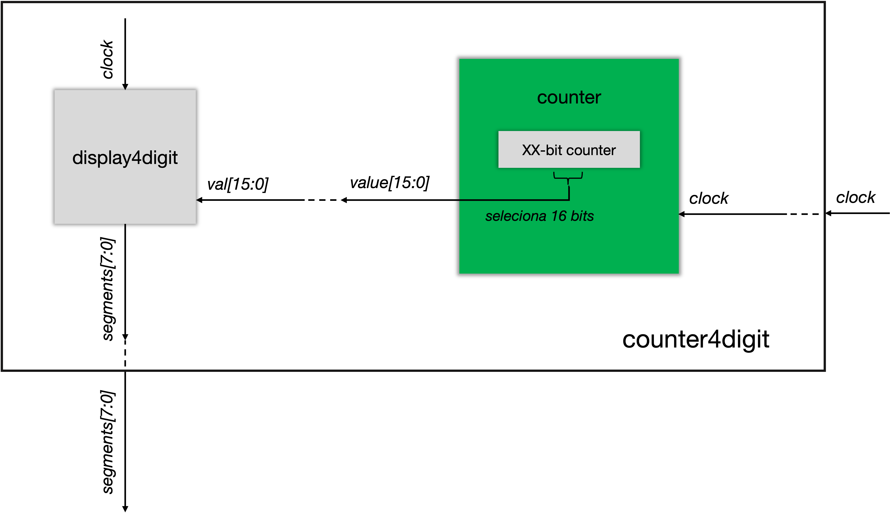

# Laboratório 6: Dispositivos de Entrada e Saída

Prof. João Carlos Bittencourt

Centro de Ciências Exatas e Tecnológicas

Universidade Federal do Recôncavo da Bahia, Cruz das Almas

## Introdução

Este laboratório é mais uma das atividades de instrumentação na plataforma de desenvolvimento DE2-115. O roteiro consiste de três etapas, cada qual construída com base na anterior. Ao longo desta prática você irá aprender a:

- Alimentar um conjunto de displays de 7 segmentos.
- Trabalhar com decimais codificados em binário (ou BCD).
- Trabalhar com um teclado PS/2.
- Integrar os dispositivos de E/S em uma demonstração.

---

## Display de 7 segmentos com 4 dígitos

Crie um novo projeto no Quartus Prime, dentro do diretório `fpga`. Copie o seu `hexto7seg.sv` do [Laboratório 4b](../../lab4/spec/spec-part-b.md) para o novo projeto e, em seguida, faça o que segue:

1. Desenvolva o módulo `counter4digit` e defina-o como módulo _top-level_ do projeto. Um diagrama de blocos para este módulo é apresentado abaixo logo em seguida.

2. Estude o arquivo `displayNdigit.sv` disponibilizado junto aos arquivos de laboratório.
   1. Este arquivo possui um módulo chamado `displayNdigit()`. Este componente é capaz de alimentar, de forma paralela, um conjunto de displays de 7 segmentos, usando, para isso, um conjunto de codificadores de dígitos hexadecimais (instância de `hexto7seg`).
   2. Observe o parâmetro `NDIG`. Ele é responsável por definir a quantidade de displays de 7 segmentos utilizados.
   3. Observe ainda o sinal de saída `segments` declarado como um _packed array_. Este procedimento ajuda a reduzir a quantidade de sinais na saída do módulo.
3. Implemente o módulo `displayNdigit` de modo que, para uma entrada de tamanho `NDIG x 4`, ele exiba o seu valor em hexadecimal em um conjunto de 4 displays de segmentos. Para isso, você poderá usar `NDIG = 4`.

> 🎯 Utilize o comando `generate` para implementar sua solução.

4. Alimente o módulo `displayNdigit` com 16 bits oriundos de um módulo contador. Este módulo é rotulado como `counter` na Figura acima (em verde).

> 💁 Você terá que modificar a largura do contador para que ele seja maior do que 32 bits, para ser capaz de selecionar 16 bits que não estejam alternando tão rapidamente. Escolha esses 16 bits de modo que o dígito hexadecimal mais à direita alterne, aproximadamente, 16 vezes por segundo; o próximo dígito irá então alternar uma vez por segundo; o digito seguinte irá comutar uma vez a cada 16 segundos; e o dígito mais a esquerda será modificado uma vez a cada 256 segundos. Todos esses tempos devem ser precisamente uma potência de dois.

5. Não esqueça de incorporar o arquivo `de2_115_default.qsf` e incluir o `de2_115_default.sdc` ao seu projeto.

## Display de 7 Segmentos com 8 Dígitos

Estenda o módulo para [display de 4 dígitos](#display-de-7-segmentos-com-4-dígitos) para um módulo de display de 8 dígitos chamado `counter8digit`, usando o módulo `displayNdigit.sv`, realizando as etapas a seguir.

1. Crie um novo módulo _top-level_ chamado `counter8digit`, semelhante ao `counter4digit` que você criou. Verifique os novos sinais de saída que precisam ser criados e certifique-se de especificar as suas atribuição. Nomeadamente, você precisará criar os sinais de saída para o display de 7 segmentos (`HEX4`, `HEX5`, `HEX6` e `HEX7`)
2. Alimente 32 bits (no lugar de 16 bits) neste _display_, a partir do módulo contador.

> 💁 Escolha esses 32 bits de modo que o dígito menos significativo alterne 256 vezes por segundo; o próximo dígito deve alternar 16 vezes por segundo; o dígito a seguir irá alternar uma vez por segundo; o próximo a cada 16 segundos e assim por diante. Todos esses tempos devem ser precisamente potências de dois.

## Entendendo o Módulo Controlador de Teclado PS/2

A principal descrição do módulo do teclado está em `keyboard.sv`. Leia o arquivo e tente entende-lo. Verifique o manual da placa DE2-115, na seção **PS/2 Serial Port**. Tudo bem se nem tudo fizer sentido neste momento.

Uma demonstração de funcionamento do teclado foi fornecida no arquivo [`keyboard_tester.sv`](../src/keyboard_tester.sv). Utilize o seu código para o display de 7 segmentos de 8 dígitos para executar o teste.

Agora, marque o arquivo de demonstração como módulo _top-level_, e implemente-o na placa. Conecte um teclado PS/2 (disponível no laboratório) à entrada PS/2 da DE2-115 (rotulada como "**PS2**", próximo aos conectores de GPIO). Ao pressionar e liberar as teclas do teclado, um código especial para cada evento (denominado _scan code_) será recebido do teclado, e exibido nos displays de 7 segmentos.

## Integrando os Dispositivos de E/S em uma Nova Demonstração

> 💁 Sua tarefa agora é criar uma nova demonstração integrando os dispositivos de E/S apresentados aqui de uma forma diferente.

Crie um novo módulo _top-level_ chamado `io_demo`, e chame seu novo arquivo de `io_demo.sv`. Integre o teclado aos 8 LEDs verdes, acima dos _push-buttons_. Codifique um conjunto de 8 caracteres ASCII, de modo que cada tecla pressionada resulte no acendimento de um único LED.

> 💁 Essencialmente, você deve mapear o _scan code_ de um conjunto arbitrário de teclas para uma sequência binária de codificação _one-hot_, a qual deve ser exibida nos LEDs verdes da placa.

## Acompanhamento (entrega: próximo laboratório)

Durante a aula esteja pronto para apresentar para o professor ou monitor:

- Os arquivos referentes à [última parte do roteiro](#integrando-os-dispositivos-de-es-em-uma-nova-demonstração): `io_demo.sv`, e `display8digit.sv`.
- Uma demonstração do [circuito contador de 8 dígitos](#display-de-7-segmentos-com-8-dígitos).
- Uma demonstração do seu circuito final na DE2-115, garantindo o funcionamento correto do codificador.

## Agradecimentos

Este laboratório é o resultado do trabalho de docentes e monitores de GCET231 ao longo dos anos, incluindo:

- **18.1:** Caio França dos Santos
- **18.2:** Matheus Rosa Pithon
- **20.2:** Matheus Rosa Pithon
- **21.1:** Matheus Rosa Pithon, Éverton Gomes dos Santos
- **21.2:** Éverton Gomes dos Santos
