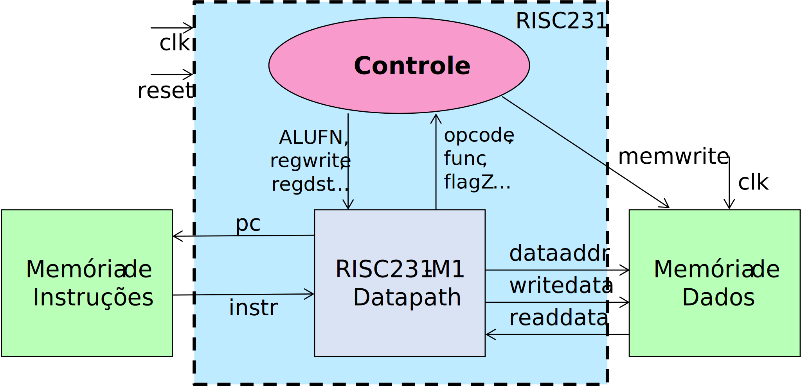
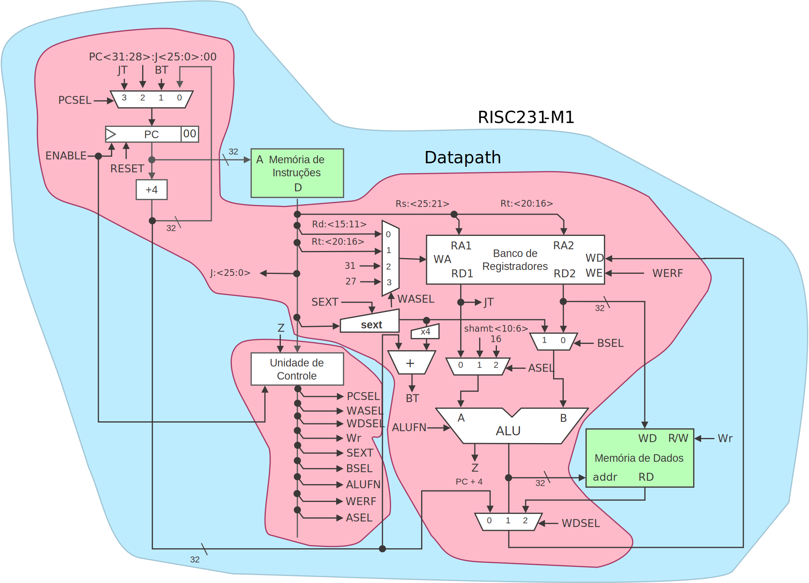
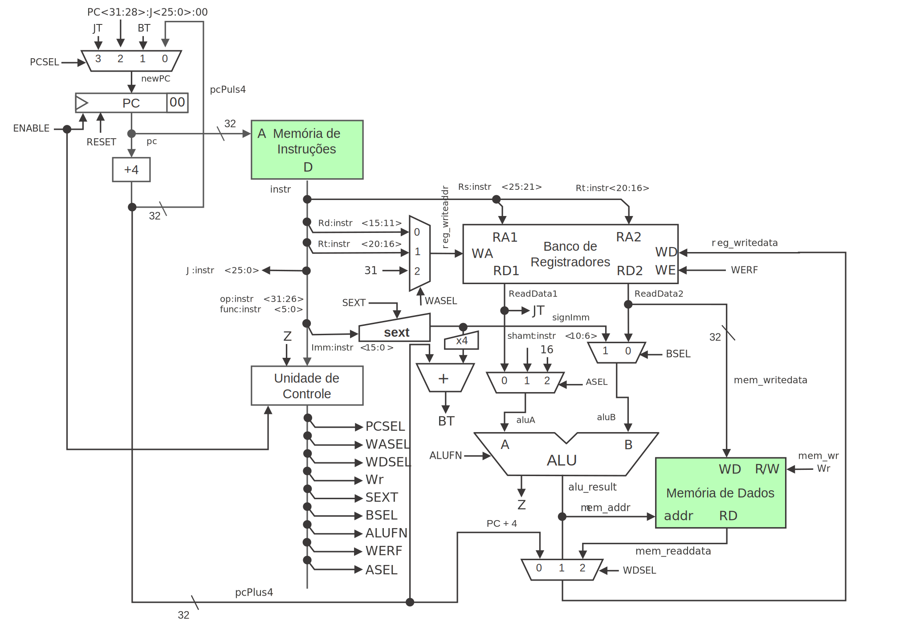

# Lab 9: Um Processador Monociclo Completo

Prof. João Carlos Bittencourt

Centro de Ciências Exatas e Tecnológicas

Universidade Federal do Recôncavo da Bahia, Cruz das Almas

## Introdução

Ao longo deste roteiro de laboratório você irá aprender a:

- Integrar ALU, registradores, etc., para formar um caminho de dados.
- Projetar a unidade de controle para um processador.
- Integrar a unidade de controle ao caminho de dados.
- Integrar unidades de memória a um processador.
- Codificar um conjunto de instruções.
- Mais práticas com _test bench_ para testes de um processador.

> 🙇‍♂️ Esse roteiro é muito mais difícil do que os anteriores. Se você não completá-lo no prazo, será difícil completar o projeto.

## Revise os Slides de Aula: Projeto do Processador RISC231-M1

Estude os slides de aula cuidadosamente, e revise os Capítulos 7.1--7.3 do [livro do David e Sarah Harris](https://www.google.com.br/books/edition/Digital_Design_and_Computer_Architecture/SksiEAAAQBAJ?hl=pt-BR&gbpv=0). Revise também o [folheto verde](https://gcet231.github.io/recursos/MIPS_Green_Sheet.pdf) do livro Patterson & Hennessy contendo o conjunto de instruções do processador MIPS.

> 🎯 Uma versão PDF deste folheto pode ser acessada [aqui](https://gcet231.github.io/recursos/MIPS_Green_Sheet.pdf). Observe que essa referência é diferente do nosso projeto em termos da implementação da `jal`. O endereço de retorno deve ser PC+4 e não PC+8.

Apesar de haverem diferenças entre os livros de autoria de Patterson & Hennessy e o livro texto Harris Harris, nós utilizaremos o primeiro. Faremos isso por que o [simulador MARS](http://courses.missouristate.edu/kenvollmar/mars/), que você utilizará para construir seu código assembly, segue o livro do Patterson & Hennessy.

Estude os Slides para identificar as decisões de projeto específicas para versão do processador utilizada em nosso laboratório:

- **Exceções:** Nosso processador não possui suporte a exceções.
- **Reset:** Nosso processador possui suporte a sinal de reset. Mais especificamente, se a entrada `reset` for acionada, o contador de programas (_program counter_) é reiniciado para o endereço `0x0040_0000`. Este endereço foi escolhido tendo em vista a compatibilidade com o assembler MARS. Desta forma, o registrador PC, presente no _caminho de dados_, deve ser inicializado neste endereço, e reiniciado sempre quando o `reset` for acionado.
- **Enable:** Para auxiliar no processo de depuração, nós vamos incorporar um sinal de entrada `enable`. Quando ativo, o processador executa normalmente as instruções. Entretanto, quando `enable == 0`, o processador "congela". Esse procedimento é realizado desativando a escrita nos seguintes componentes: _program counter_, _register file_ e _memória de dados_. Essa modificação nos permitirá executar os programas passo-a-passo, auxiliando assim no processo de depuração.

## A Unidade de Controle

Para preparar o projeto do processador RISC231, nós iniciaremos com o desenvolvimento da unidade de controle. A seguir são apresentados dois diagramas no nosso processador RISC231 _single-cycle_, o primeiro com uma visão de alto nível, e em seguida uma visão mais detalhada.

A seguir está a figura contendo uma visão mais detalhada.

Primeiro vamos desenvolver a unidade de controle. Ela deve dar suporte a **TODAS as 31 instruções** apresentadas a seguir:

- Load (`lw`) e store (`sw`)
- Instruções do Tipo-I: `addi`, `addiu`, `slti`, `sltiu`, `ori`, `lui`, `andi`, `xori`}
  - ⚠️ Diferente do que você possa ter aprendido (em GCET235), `addiu`, na verdade, não realiza uma soma sem sinal (_unsigned_). Na verdade, ela estende o sinal do imediato (replica o bit mais significativo até completar os 32 bits). A única diferença entre `addiu` e `addi` é que a instrução `addiu` não provoca uma exceção na presença de um _overflow_, enquanto que a `addi` sim. Como não estamos implementando exceções no nosso processador, `addiu` e `addi` são idênticas para nossos propósitos.
  - ⚠️ Também diferente do que você possa ter aprendido, a instrução `sltiu` na verdade também estende o sinal do imediato, _mas realiza uma comparação sem sinal_. Ou seja, `ALUFN` é `LTU`.
  - Note ainda que a instrução `ori` deve estender zero o imediato (completar a palavra com zeros), por se tratar de uma operação lógica! Finalmente, a extensão do sinal para a instrução `lui` é um _don't-care_, uma vez que o imediato de 16-bits é posicionado na parte mais significativa do registrador.
- Instruções do Tipo-R: `add, addu, sub, and, or, xor, nor, slt, sltu, sll, sllv, srl, srlv, sra` e `srav`
  - ⚠️ Para nossos propósitos, a instrução `addu` é _idêntica_ à instrução `add`. A diferença está apenas na foma como elas lidam com o _overflow_. A razão para darmos suporte à instrução `addu` é que o assembler MARS geralmente introduz automaticamente instruções `addu` no nosso código, especialmente para a faixa de endereços de memória que nós usaremos.
- Instruções do Tipo-J e saltos condicionais (_branches_ - Tipo-I): `beq, bne, j, jal, jr` e `jalr`.

Estude o [material de aula sobre o processador RISC231 mono-ciclo](https://gcet231.github.io/#/4-aplicacao/3-processador/README). Em seguida preencha a Tabela abaixo com os valores de todos os sinais de controle para as instruções listadas aqui. Se o valor de um sinal de controle não importa para uma dada instrução, você deve usar o símbolo de _don't care_ (ex.: `1'bx`, `2'bx`, etc., dependendo da quantidade de bits).

> 💁 A partir dos valores da Tabela, complete o código Verilog da unidade de controle no arquivo [`controler.sv`](../src/controller.sv), disponibilizado junto com os arquivos de laboratório.

Utilize o _test bench_ fornecido para simular e validar o seu projeto. Esse _test bench_ é auto-verificável, de modo que qualquer erro será sinalizado no _waveform_ do simulador automaticamente.

> ⚠️ Certifique-se de utilizar os mesmos nomes presentes no teste para as entradas e saídas do _top-level_.

|  Type  | Instr | werf | wdsel | wasel | asel | bsel | sext | wr  | alufn |   pcsel    |
| :----: | :---: | :--: | :---: | :---: | :--: | :--: | :--: | :-: | :---: | :--------: |
| I-Type |  LW   |  1   |  10   |  01   |  00  |  1   |  1   |  0  | 0XX01 |            |
|        |  SW   |      |       |       |      |      |      |     |       |            |
|        | ADDI  |      |       |       |      |      |      |     |       |            |
|        | ADDIU |      |       |       |      |      |      |     |       |            |
|        | SLTI  |      |       |       |      |      |      |     |       |            |
|        | SLTIU |      |       |       |      |      |      |     |       |            |
|        |  ORI  |      |       |       |      |      |      |     |       |            |
|        |  LUI  |      |       |       |      |      |      |     |       |            |
|        | ANDI  |      |       |       |      |      |      |     |       |            |
|        | XORI  |      |       |       |      |      |      |     |       |            |
|        |  BEQ  |      |       |       |      |      |      |     |       | Z=1 \| Z=0 |
|        |  BNE  |      |       |       |      |      |      |     |       | Z=1 \| Z=0 |
| J-Type |   J   |      |       |       |      |      |      |     |       |            |
|        |  JAL  |      |       |       |      |      |      |     |       |            |
| R-Type |  ADD  |      |       |       |      |      |      |     |       |            |
|        | ADDU  |      |       |       |      |      |      |     |       |            |
|        |  SUB  |      |       |       |      |      |      |     |       |            |
|        |  AND  |      |       |       |      |      |      |     |       |            |
|        |  OR   |      |       |       |      |      |      |     |       |            |
|        |  XOR  |      |       |       |      |      |      |     |       |            |
|        |  NOR  |      |       |       |      |      |      |     |       |            |
|        |  SLT  |      |       |       |      |      |      |     |       |            |
|        | SLTU  |      |       |       |      |      |      |     |       |            |
|        |  SLL  |      |       |       |      |      |      |     |       |            |
|        | SLLV  |      |       |       |      |      |      |     |       |            |
|        |  SRL  |      |       |       |      |      |      |     |       |            |
|        | SRLV  |      |       |       |      |      |      |     |       |            |
|        |  SRA  |      |       |       |      |      |      |     |       |            |
|        | SRAV  |      |       |       |      |      |      |     |       |            |
|        |  JR   |      |       |       |      |      |      |     |       |            |
|        | JALR  |      |       |       |      |      |      |     |       |            |

## Projete o processador RISC231 Monociclo

Junte todas as partes do diagrama do caminho de dados para criar um processador RISC mono-ciclo tal qual discutido em aula. Os códigos Verilog para alguns dos módulos foram disponibilizados junto com os arquivos de laboratório. Especificamente, você deverá realizar as tarefas elencadas a seguir.

- **Descreva o processador RISC231-M1, juntamente com as memórias de instruções e dados**, como apresentado em aula. Comece com o arquivo [`top.sv`](../src/top.sv), o qual já possui o módulo _top level_ em Verilog. Entenda como ele foi projetado conforme o diagrama de blocos apresentado no início do roteiro, e tome nota de **todos** os parâmetros.

  O tamanho das memórias de instrução e dados deve ser parametrizado para alterações nesses tamanhos dependendo das necessidades do programa (por exemplo, na sua demonstração final) que queremos executar em nosso processador (o _test bench_ fornecido define os tamanhos para 128 posições de memória para a memória de instruções e 64 para memória de dados).

  > 💁 Os endereços produzidos pelo processador para acessar as memórias ainda continuarão sendo de 32 bits, mesmo que sejam utilizados menos bits de endereço. Use os módulos ROM e RAM fornecidos ([`rom_module.sv`](../src/rom_module.sv) e [`ram_module.sv`](../src/ram_module.sv)), e observe o seguinte:

  - A memória de instruções será uma ROM, enquanto a memória de dados será uma RAM. Nós iremos instanciar os módulos ROM e RAM (sem modificar duas descrições Verilog), e fornecer os parâmetros adequados, os quais são definidos no módulo _top-level_ de teste. (veja o `top.sv`).
  - Nós vamos enviar todos os 32 bits do contador de programas (`PC`) para fora do processador, mas eliminaremos os dois bits menos significativos na interface antes de conectá-lo à memória de instruções. Ou seja, _apenas uma palavra de endereço de 30 bits_ é conectada à memória de instruções. Isso possibilita converter um endereço de byte para um endereço de palavra. (veja o `top.sv`).
  - Da mesma maneira, vamos enviar todos os 32 bits de endereço da memória de dados para fora do processador, eliminando os dois bits menos significativos da interface. Desse modo, _apenas uma palavra de endereço de 30 bits_ é de fato conectada à memória de dados (veja o `top.sv`).
  - Ambas as memórias devem retornar uma palavra de 32 bits (ou seja, `Dbits = 32`). Seus valores iniciais são lidos a partir do `initfile`, o qual corresponde ao nome do arquivo de inicialização da memória.

- **Inicialize as memórias de instruções e dados** utilizando o método apresentado no [Lab 7](../../lab7/spec/spec.md). O arquivo que possui os valores iniciais para a memória de instruções conterá uma instrução codificada de 32 bits por linha (em hexadecimal). O arquivo contendo os valores iniciais para a memória de dados também terá apenas valores de dados de 32 bits, novamente um a cada linha.

  > 💁 Você pode criar estes arquivos dentro do próprio Quartus Prime, ou utilizando seu editor de textos preferido.

- **O módulo do processador, contendo os blocos controlador e _data path_,** foi fornecido dentro do arquivo [`risc231-m1.sv`](../src/risc231_m1.sv). Entenda como ele se espelha no diagrama de blocos apresentado a seguir.

  > ✅ Observe que há diferenças entre o projeto do MIPS do livro de Harris e Harris e o que nós estamos desenvolvendo neste roteiro. O nosso processador possui uma versão da ALU muito mais sofisticada. Portanto, não siga cegamente as informações presentes no livro; ao invés disso, acompanhe o material de aula e anotações dos laboratórios. O caminho de dados deve ser de 32 bits (ou seja, registradores, ALU, memória de dados e memória de instruções, usam palavras de 32 bits).

- **Complete todas as pequenas peças** do caminho de dados, de forma que o projeto se pareça o apresentado na aula, reproduzido a seguir. Pequenos conjuntos de lógica podem ser "aninhados" (no lugar de escritos em módulos separados), por exemplo, multiplexadores, extensor de sinal, somadores, deslocamento-por-2, etc.

As figuras apresentada na seção [A Unidade de Controle](#a-unidade-de-controle) apresentam uma decomposição hierárquica do projeto _top-level_. Atente-se que o seu projeto deve seguir **exatamente** essa hierarquia.

Outras dicas que podem te ajudar durante os testes:

- **Lembre-se de usar a diretiva `default_nettype none`** para facilitar a identificação de declarações ausentes ou incompatibilidades de nomes devido a erros de digitação, etc.
- **É altamente recomendável que você conecte entradas/saídas pelo nome,** especialmente para módulos que contenham muitas entradas/saídas. Caso contrário, será fácil desalinhar as portas, causando dores de cabeça durante a depuração. Você pode seguir o estilo apresentado no arquivo [`risc231-m1.sv`](../src/risc231_m1.sv) para as conexões do controlador e do caminho de dados.
- **Use o _test bench_ para testar seu processador por meio de simulação.** Um testador auto-verificável foi fornecido junto com os arquivos do laboratório. Ele foi elaborado primeiro escrevendo o código em linguagem de montagem MIPS, depois compilando esse código usando MARS. Por fim, as instruções foram convertidas em código de máquina hexadecimal, que deve ser usado para inicializar sua memória de instrução. Armazene o código de máquina no arquivo usado para inicializar a memória de instruções. Certifique-se de inicializar o contador de programas (`PC`) dentro do seu processador para `0x0040_0000`, para que ele comece a ser executado a partir do início da memória de instruções. Da mesma forma, para inicializar sua memória de dados, coloque os valores iniciais no arquivo correspondente.
  - O _test bench_ é chamado de **full** ([`risc231_m1_full_tb.sv`](../sim/tb/risc231_m1_full_tb.sv)). O programa de montagem ([`full.asm`](../app/full.asm)) executa cada uma das 31 instruções que implementamos, incluindo chamadas/retornos de procedimento e recursão usando uma pilha. Você não precisa executar este programa no MARS, mas pode se assim desejar. A memória de instruções deve ser dimensionada para acomodar pelo menos a quantidade de posições presentes no código de máquina, e tipicamente é uma potência de 2. Ao todo, o _test bench_ define o tamanho da memória de instruções como 128.
    > 💁 Certifique-se de especificar os nomes corretos dos arquivos que possuem valores de inicialização das memórias de instruções e dados ([`full_imem.mem`](../sim/tests/full_imem.mem) e [`full_dmem.mem`](../sim/tests/full_dmem.mem), respectivamente) no _test bench_.
- **Por enquanto, você não vai implementar esse projeto na placa.** Você fará isso no projeto final.
- **Se desejar, você pode utilizar o [simulador MARS](http://courses.missouristate.edu/KenVollmar/MARS/)** para analisar o código assembly.
- **Comece a pensar no que você gostaria de construir para seu projeto final!** Todos os projetos devem usar um monitor VGA como saída. Todas as placas possuem chaves e LEDs. Entradas por teclado também devem estar presentes em todos os projetos. Comece a pensar!

> 🍀 Boa sorte!

## Acompanhamento

Durante a aula esteja pronto para apresentar para o professor ou monitor:

### Parte 1: Unidade de Controle (entrega: sexta-feira 18 de novembro, 2022)

- A tabela da unidade de controle devidamente preenchida.
  - Utilize o template em [LaTeX](./uc_table.tex) ou [Markdown](./uc_table.md).
- O arquivo Verilog: `controller.sv`.
- A simulação para a [Unidade de Controle](#a-unidade-de-controle), utilizando o [_test bench_](../sim/tb/controller_tb.sv) fornecido junto com os arquivos de laboratório.

### Parte 2: Processador RISC231 Monociclo (entrega: sexta-feira 25 de novembro, 2022)

- **TODOS** os arquivos Verilog, com exceção a ALU e seus sub-módulos.
- Uma demonstração de funcionamento do seu processador utilizando o [_test bench_ full auto-verificável](../sim/tb/risc231_m1_full_tb.sv) fornecido junto com os arquivos de laboratório.

## Agradecimentos

Esse roteiro é fruto do trabalho coletivo dos professores e monitores de GCET231:

- **18.1:** Caio França dos Santos
- **18.2:** Matheus Rosa Pithon
- **20.2:** Matheus Rosa Pithon
- **21.1:** Matheus Rosa Pithon, Éverton Gomes dos Santos
- **21.2:** Éverton Gomes dos Santos
